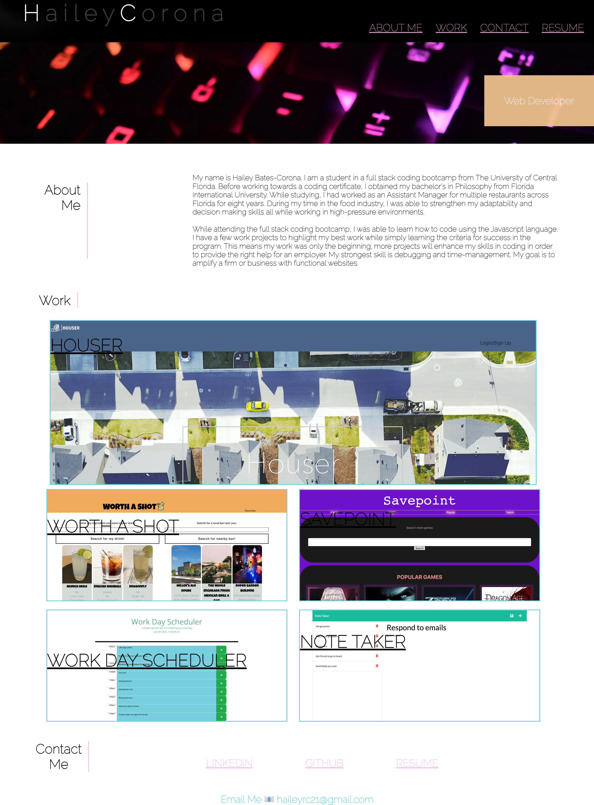

## Hailey Bates Work Portfolio
This is the work portfolio homework for UCF bootcamp, week 1!
For this repo, we have a code made from scratch to create a work portfolio for class and future jobs as a developer! In this assignment, I utilized flexbox in CSS to creat a webpage to mimic the example in the homework assignment. Future edits will be made to add future projects in order to get the final product 

[Live Link](https://haileyrb25.github.io/Work_Portfolio/)
Click this link to see the optimization that was worked on to improve the page. All changes have been posted to this live website.

[Live Link](https://github.com/haileyrb25/Work_Portfolio)
Click this link to see my github activity for this repository!

Here is what the final product looks like:

